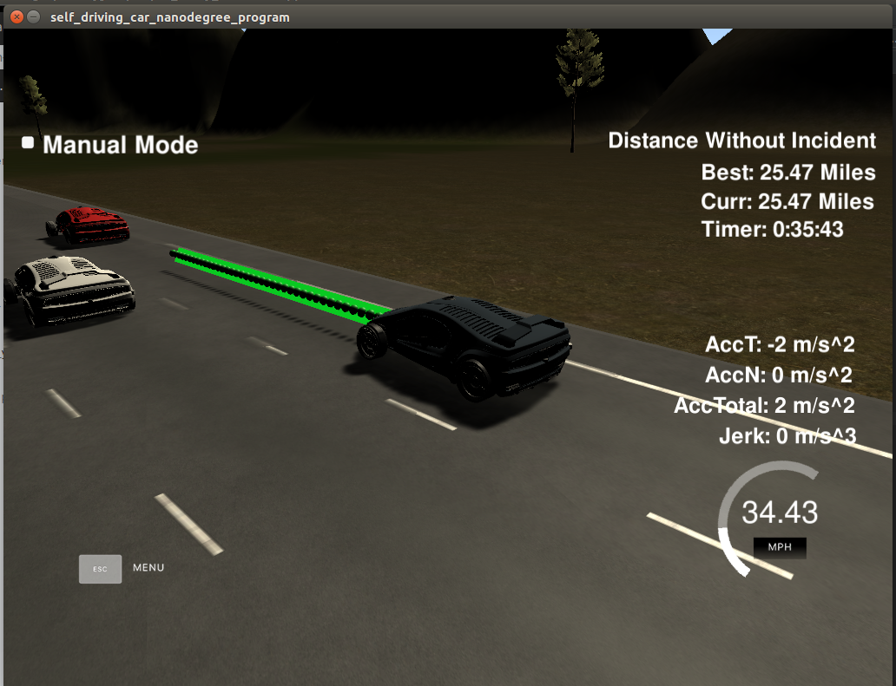

# CarND-PathPlanningProject-P11
Create a path planner that is able to navigate a car safely around a virtual highway

### Overview
In this project, we implemented a path planning algorithm that successfully drives a vehicle on the highway. The car needs to:
* Successfully change lanes in order to keep the maximum legal speed
* Avoid collisions
* Maintain a maximum speed for as long as possible
* Utilise the sensor fusion information to detect vehicles on the highway and adapt depending on their position and speed on the lanes

### Rubic Points

#### Compilation
The code compiles correctly
```
cd /CarND-Path-Planning-Project/build
cmake .. && make
```

#### Valid Trajectories
* The car is able to drive at least 4.32 miles without incident  
The vehicle can successfully complete more than the miles suggested here



* The car drives according to the speed limit.  
The car keeps a max 49.5mph speed and doesn't exceed that. It successfully drives on the simulation without any warning signs.

* Max Acceleration and Jerk are not Exceeded.  
As before no warning sign appeared. Max acc and jerk were not exceeded

* Car does not have collisions.
As before the car didn't have any collision during its route on the highway

* The car stays in its lane, except for the time between changing lanes.  
When the car finds a turn on the road it might get out of the middle line for a bit but after leaving the apex it is driving back to the middle line.

* The car is able to change lanes.  
It is able to change lanes depending on what it sees in front and on the sides

#### Reflection
There is a reflection on how to generate paths.  
The Q&A video really helped a lot on getting this project going. After cloning the repo, I added the spline header file on `src/spline.h` and did all the changes on `src/main.cpp`, for ease.
The code, as instructed, can be divided in three parts: prediction, behavior and trajectory.
* Prediction (ln 108 - 155):
Depending on the input from telemetry and sensor fusion, I update the flags `car_front, car_right, car_left` according to whether there is a car in front, on the right or left, respectively. Those flags are being used as lane identifiers.
Input data format: `//sensor_fusion[id, x, y, vx, vy, s, d]` for the detected vehicles. I estimate the vehicle's s position in order to find the position it will be in the future. I check the s values greater than ours and the s-gap to make sure I have a gap of at least 30meters before changing lane. I update the flags depending on which lane the car is and the gap that I have.

* Behavior (ln 157 - 179):
Here we take action; we either change lane or adapt the speed in order to avoid collisions. The vehicle changes lane depending on the updated flags from the previous step. First, it checks whether a vehicle is in front of it and then it decides whether to change lane or to slow down.

* Trajectory (ln 184 - 285):
On this final step we perform trajectory generation based on the speed and the lane we have output from the previous steps and additionally based on the vehicle's position and previous waypoints generated. First, we create a list of waypoints, evenly spaced at 30meters. We use the previous path's endpoint as initial reference waypoint and redefine the reference state as previous path end point. Using Frenet cords we add 30 meters of evenly spaced points ahead of the starting reference points. The important bit here is that we calculate the trajectory based on the last two points of the already covered trajectory. If the vehicle hasn't covered those 60 meters, we use the current position as initial.  
Then, we use splines as a method to generate the trajectory. We perform a shift and rotate transform. The computed waypoints are transformed using a spline taking into account acceleration and velocity. In total we generate 50 waypoints. 


### Simulator.
You can download the Term3 Simulator which contains the Path Planning Project from the [releases tab (https://github.com/udacity/self-driving-car-sim/releases/tag/T3_v1.2).  

To run the simulator on Mac/Linux, first make the binary file executable with the following command:
```shell
sudo chmod u+x {simulator_file_name}
```

### Goals
In this project your goal is to safely navigate around a virtual highway with other traffic that is driving +-10 MPH of the 50 MPH speed limit. You will be provided the car's localization and sensor fusion data, there is also a sparse map list of waypoints around the highway. The car should try to go as close as possible to the 50 MPH speed limit, which means passing slower traffic when possible, note that other cars will try to change lanes too. The car should avoid hitting other cars at all cost as well as driving inside of the marked road lanes at all times, unless going from one lane to another. The car should be able to make one complete loop around the 6946m highway. Since the car is trying to go 50 MPH, it should take a little over 5 minutes to complete 1 loop. Also the car should not experience total acceleration over 10 m/s^2 and jerk that is greater than 10 m/s^3.

#### The map of the highway is in data/highway_map.txt
Each waypoint in the list contains  [x,y,s,dx,dy] values. x and y are the waypoint's map coordinate position, the s value is the distance along the road to get to that waypoint in meters, the dx and dy values define the unit normal vector pointing outward of the highway loop.

The highway's waypoints loop around so the frenet s value, distance along the road, goes from 0 to 6945.554.

## Basic Build Instructions

1. Clone this repo.
2. Make a build directory: `mkdir build && cd build`
3. Compile: `cmake .. && make`
4. Run it: `./path_planning`.

Here is the data provided from the Simulator to the C++ Program

#### Main car's localization Data (No Noise)

["x"] The car's x position in map coordinates

["y"] The car's y position in map coordinates

["s"] The car's s position in frenet coordinates

["d"] The car's d position in frenet coordinates

["yaw"] The car's yaw angle in the map

["speed"] The car's speed in MPH

#### Previous path data given to the Planner

//Note: Return the previous list but with processed points removed, can be a nice tool to show how far along
the path has processed since last time. 

["previous_path_x"] The previous list of x points previously given to the simulator

["previous_path_y"] The previous list of y points previously given to the simulator

#### Previous path's end s and d values 

["end_path_s"] The previous list's last point's frenet s value

["end_path_d"] The previous list's last point's frenet d value

#### Sensor Fusion Data, a list of all other car's attributes on the same side of the road. (No Noise)

["sensor_fusion"] A 2d vector of cars and then that car's [car's unique ID, car's x position in map coordinates, car's y position in map coordinates, car's x velocity in m/s, car's y velocity in m/s, car's s position in frenet coordinates, car's d position in frenet coordinates. 

## Details

1. The car uses a perfect controller and will visit every (x,y) point it recieves in the list every .02 seconds. The units for the (x,y) points are in meters and the spacing of the points determines the speed of the car. The vector going from a point to the next point in the list dictates the angle of the car. Acceleration both in the tangential and normal directions is measured along with the jerk, the rate of change of total Acceleration. The (x,y) point paths that the planner recieves should not have a total acceleration that goes over 10 m/s^2, also the jerk should not go over 50 m/s^3. (NOTE: As this is BETA, these requirements might change. Also currently jerk is over a .02 second interval, it would probably be better to average total acceleration over 1 second and measure jerk from that.

2. There will be some latency between the simulator running and the path planner returning a path, with optimized code usually its not very long maybe just 1-3 time steps. During this delay the simulator will continue using points that it was last given, because of this its a good idea to store the last points you have used so you can have a smooth transition. previous_path_x, and previous_path_y can be helpful for this transition since they show the last points given to the simulator controller with the processed points already removed. You would either return a path that extends this previous path or make sure to create a new path that has a smooth transition with this last path.

## Tips

A really helpful resource for doing this project and creating smooth trajectories was using http://kluge.in-chemnitz.de/opensource/spline/, the spline function is in a single hearder file is really easy to use.

---

## Dependencies

* cmake >= 3.5
  * All OSes: [click here for installation instructions](https://cmake.org/install/)
* make >= 4.1
  * Linux: make is installed by default on most Linux distros
  * Mac: [install Xcode command line tools to get make](https://developer.apple.com/xcode/features/)
  * Windows: [Click here for installation instructions](http://gnuwin32.sourceforge.net/packages/make.htm)
* gcc/g++ >= 5.4
  * Linux: gcc / g++ is installed by default on most Linux distros
  * Mac: same deal as make - [install Xcode command line tools]((https://developer.apple.com/xcode/features/)
  * Windows: recommend using [MinGW](http://www.mingw.org/)
* [uWebSockets](https://github.com/uWebSockets/uWebSockets)
  * Run either `install-mac.sh` or `install-ubuntu.sh`.
  * If you install from source, checkout to commit `e94b6e1`, i.e.
    ```
    git clone https://github.com/uWebSockets/uWebSockets 
    cd uWebSockets
    git checkout e94b6e1
    ```
